# 0910 Connector 조사 #2

- Connectors
    - Siteleaf
        - Siteleaf 란?

            

            Siteleaf는 사용자가 웹 사이트를 작성, 편집 및 유지할 수있는 온라인 컨텐츠 관리 시스템입니다.

        - Triggers
            - 새 사이트 : 새 사이트가 생성 될 때 트리거됩니다.
            - 새 페이지 : 새 페이지가 생성 될 때 트리거됩니다.
        - Actions
            - 페이지 만들기 : 특정 사이트에 새 페이지를 만듭니다.
            - 사이트 만들기 : 새 사이트 만들기
            - 페이지 삭제 : 특정 페이지 삭제
            - 사이트 삭제 : 특정 사이트를 삭제합니다.
            - 페이지 가져 오기 : 특정 페이지를 가져옵니다.
            - 페이지 가져 오기 : 일부 또는 모든 페이지를 가져옵니다.
            - 게시물 가져 오기 : 특정 사이트에서 모든 게시물을 검색합니다.
            - 사이트 세부 정보 가져 오기 : 특정 사이트의 세부 정보를 가져옵니다.
            - 사이트 가져 오기 : 모든 사이트 가져 오기
            - 페이지 업데이트 : 특정 페이지 업데이트
            - 업데이트 사이트 : 특정 사이트 업데이트
        - Authorize
            - Siteleaf의 API 키 및 API 시크릿을 검색하는 방법
                1. 트리거 또는 조치를 구성하기 위해 Siteleaf 계정을 작성하려고 할 때마다 다음 창이 표시됩니다.

                    

                1. Siteleaf 계정에 로그인하십시오. 로그인 한 후 왼쪽 패널에 나열된 설정 옵션을 클릭합니다 .

                    

                2. API 키 및 API 암호 검색 **설정** 옵션을 클릭하면 화면에 창이 나타납니다. 창의 오른쪽 패널에서 **계정 설정** 옵션을 클릭 **합니다** . 

                    

                3. 이 옵션을 클릭하면 내 계정 화면 으로 리디렉션됩니다 . 상단에 나열된 API 탭을 클릭하십시오 . 

                    

                4. 표시되는 창에서 Siteleaf 계정과 연결된 API 키 및 API 비밀 을 볼 수 있습니다. 

                    

                    WebMethods.io 통합의 **Siteleaf에 연결** 창에 있는 **API 키** 및 **API 비밀** 필드에 각각 API 키 및 API 비밀을 복사하여 붙여 넣은 다음 추가를 클릭하십시오.

                    계정이 자동으로 생성되고 **Siteleaf** 에 **연결** 필드 아래에 추가됩니다 .  추가되면이 계정은 모든 Siteleaf 조치 및 트리거에서 사용할 수 있습니다.

    - JotForm
        - JotForm 란?

            

            JotForm은 사용자가 양식을 게시하고 응답을받을 수 있도록 도와주는 온라인 양식 작성 도구입니다.

        - Triggers

            새 제출 : 새 제출이 제출 될 때 트리거됩니다.

        - Actions
            - 양식 세부 정보 가져 오기 : 특정 양식의 세부 정보를 검색합니다.
            - 양식 삭제 : 기존 양식을 삭제합니다.
            - 양식 만들기 : 계정에서 새 양식 만들기

        - Authorize

            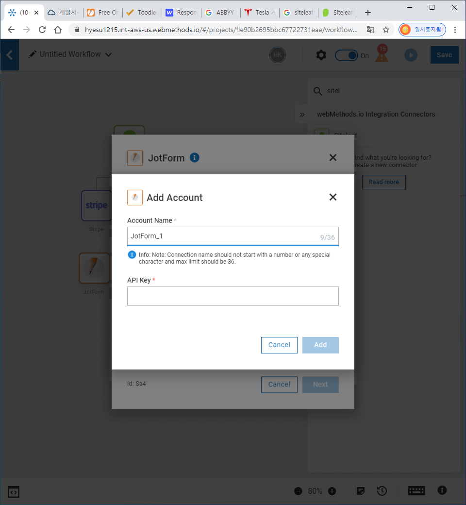

            

            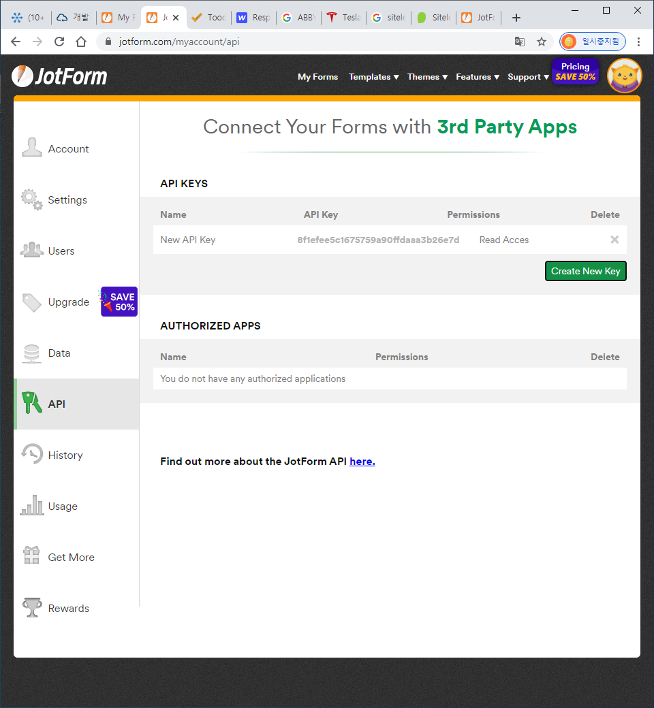

            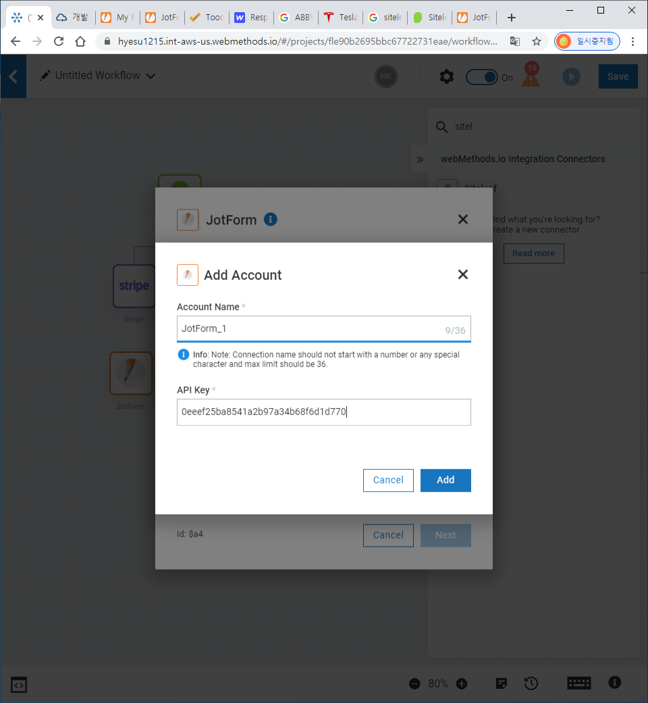

    - Webflow
        - Webfolw 란?

            

            Webflow는 코딩 지식이 없어도 반응 형 웹 사이트를 디자인, 구축 및 실행할 수있는 웹 디자인 도구입니다.

        - Triggers
            - 게시 된 새 사이트 : 새 사이트가 게시 될 때 트리거됩니다.
            - 새 양식 제출 : 새 양식이 제출 될 때 트리거됩니다.

        - Actions
            - 항목 만들기 : 지정된 컬렉션에 새 항목을 만듭니다.
            - 컬렉션 가져 오기 : 지정된 사이트에서 컬렉션 목록을 검색합니다.
            - 컬렉션 세부 정보 가져 오기 : 사이트에서 지정된 컬렉션의 세부 정보를 검색합니다.
            - 항목 세부 정보 가져 오기 : 컬렉션에서 지정된 항목의 세부 정보를 검색합니다.
            - 항목 가져 오기 : 컬렉션에서 지정된 항목 목록을 검색합니다.
            - 사이트 세부 정보 가져 오기 : 특정 사이트의 세부 정보를 가져옵니다.
            - 사이트 가져 오기 : 모든 사이트 목록을 가져옵니다.
            - 항목 업데이트 : 컬렉션에서 특정 항목을 업데이트합니다.

        - Authorize

            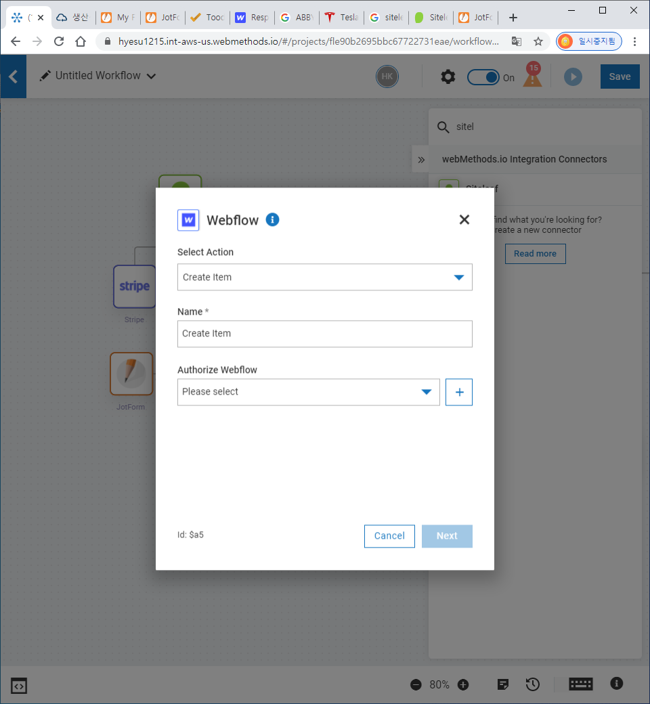

            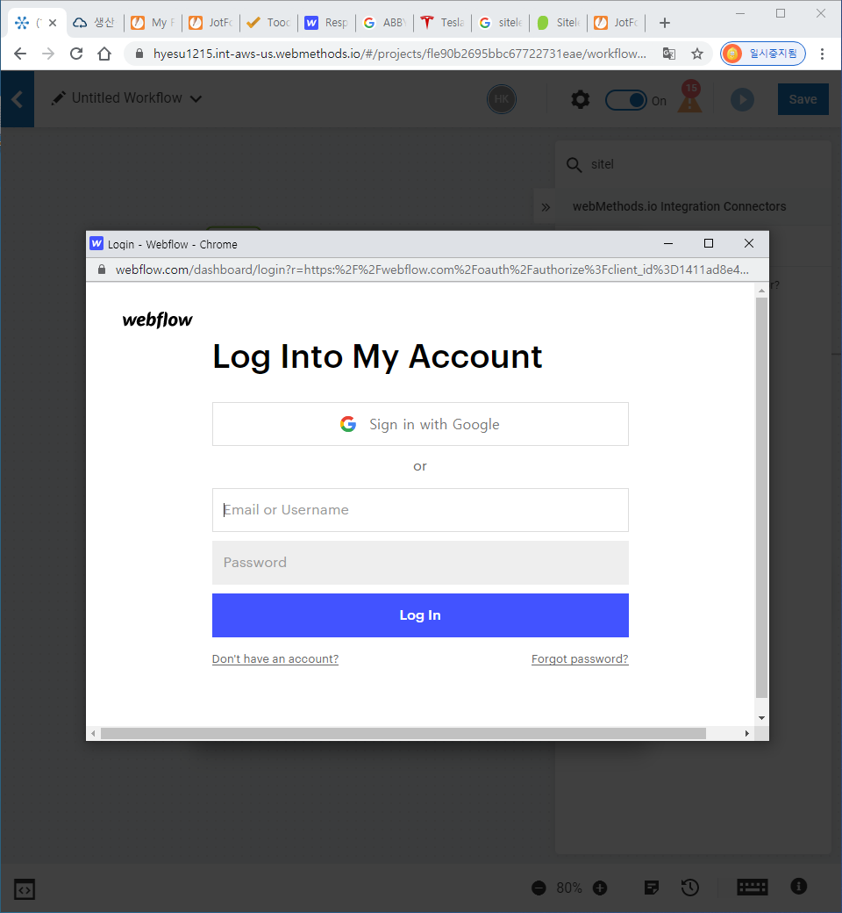

            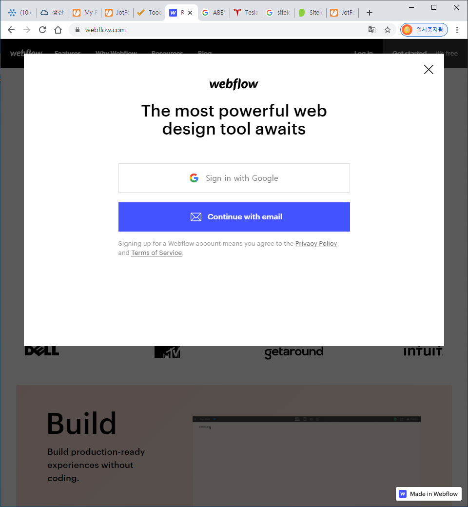

            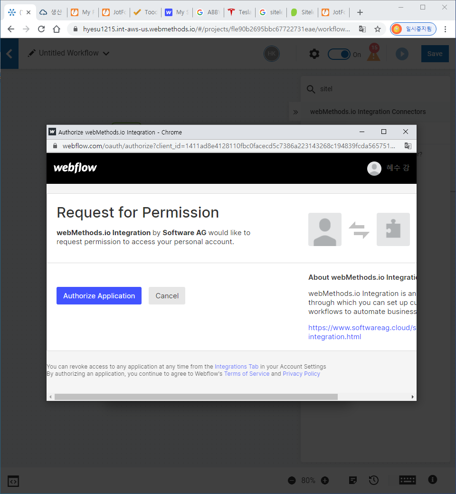

    - Toodledo
        - Toodledo 란?

            

            Toodledo는 모든 작업, 메모, 파일 및 폴더를 한 곳에 저장할 수있는 온라인 프로젝트 관리 도구입니다.

        - Triggers
            - 신규 / 수정 된 작업 : 새 작업이 생성되거나 기존 작업이 수정 될 때 트리거됩니다.
            - 폴더의 새 / 수정 된 작업 : 새 작업이 생성되거나 특정 폴더에서 기존 작업이 수정 될 때 트리거됩니다.
            - 컨텍스트 내 신규 / 수정 된 작업 : 특정 컨텍스트에서 새 작업이 생성되거나 기존 작업이 수정 될 때 트리거됩니다.
            - 새 폴더 : 새 폴더가 생성 될 때 트리거됩니다.
            - 완료로 표시된 작업 : 작업이 완료되면 트리거됩니다.
            - 별표 표시된 작업 : 작업이 별표 표시 될 때 트리거됩니다.
            - 신규 / 수정 된 노트 : 새 노트가 생성되거나 기존 노트가 수정 될 때 트리거됩니다.
            - 신규 / 수정 된 목록 : 새 목록이 생성되거나 기존 목록이 수정 될 때 트리거됩니다.

        - Actions
            - 폴더 생성 : 새 폴더 생성
            - 노트 만들기 : 새 노트 만들기
            - 작업 생성 : 새 작업 생성
            - 폴더 삭제 : 지정된 폴더를 삭제합니다.
            - 메모 삭제 : 지정된 메모를 삭제합니다.
            - 작업 삭제 : 지정된 작업을 삭제합니다.
            - 폴더 가져 오기 : 모든 폴더의 세부 정보를 가져옵니다.
            - 메모 가져 오기 : 모든 메모의 세부 정보를 검색합니다.
            - 작업 가져 오기 : 특정 작업 또는 모든 작업의 세부 정보를 검색합니다.
            - 폴더 업데이트 : 기존 폴더 업데이트

        - Authorize

            

            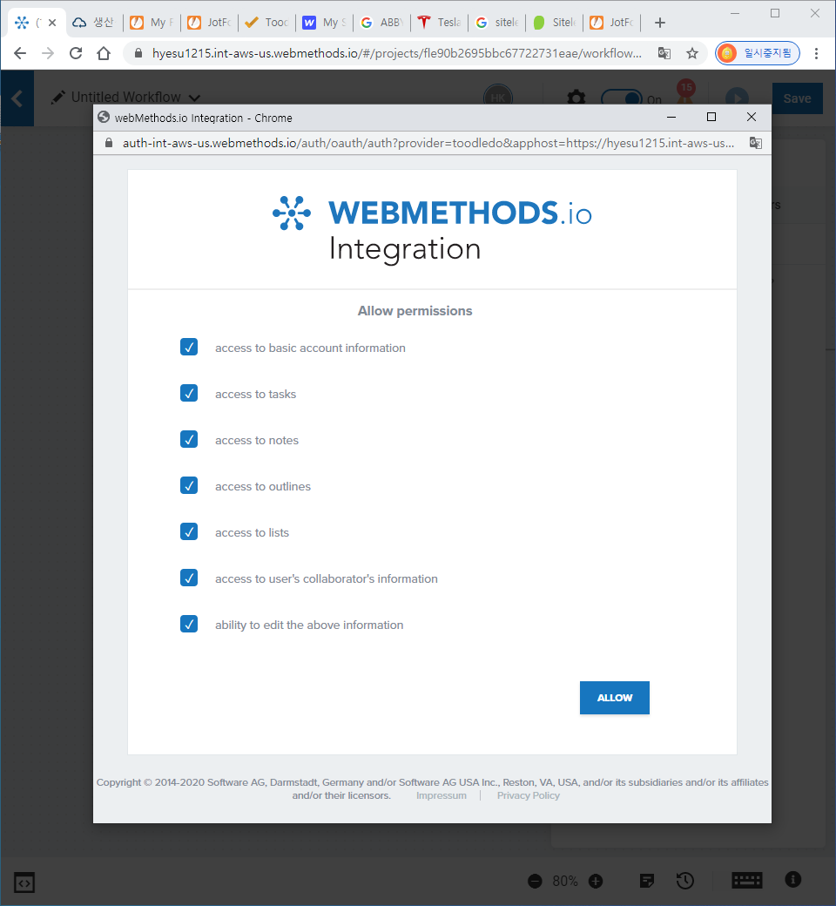

            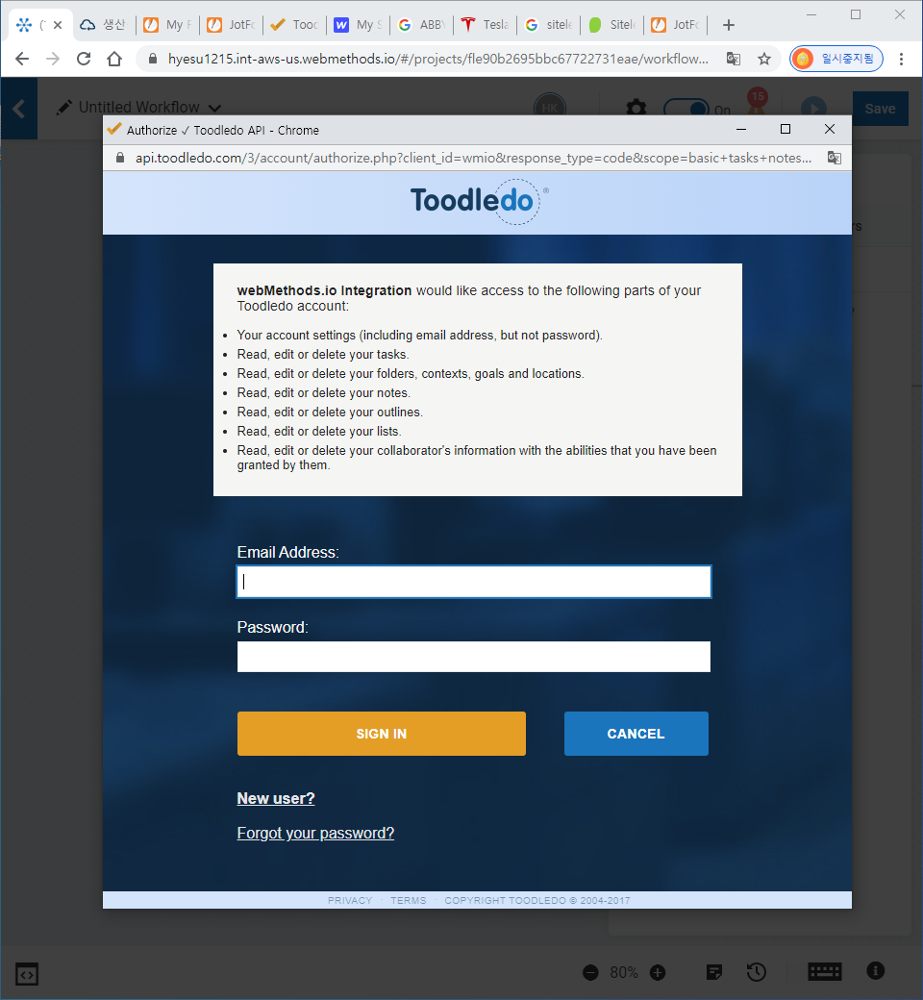

            

            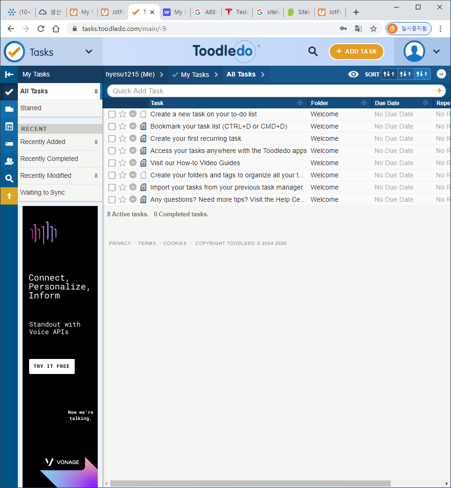

            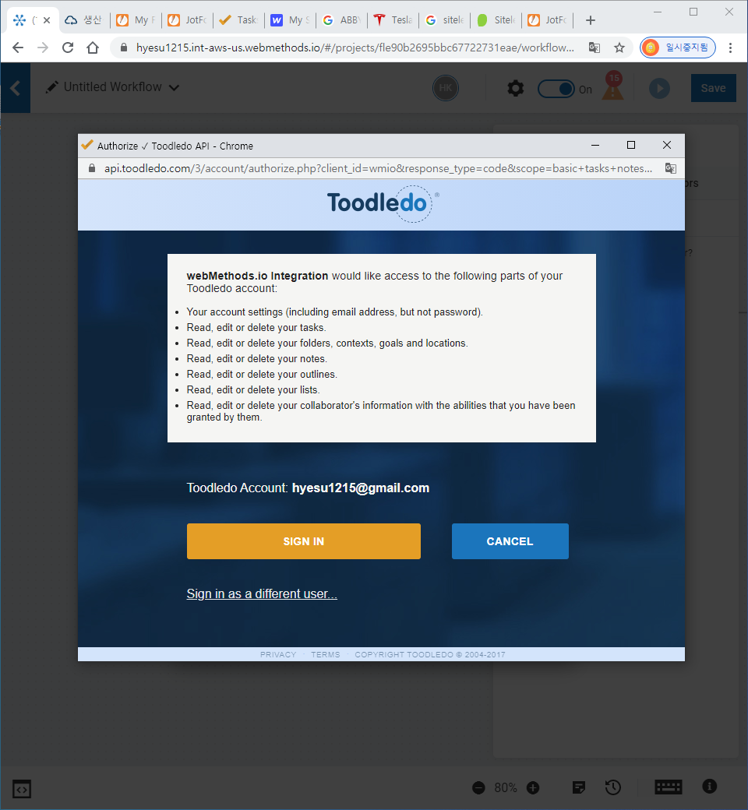

    - Tesla
        - Tesla 란?

            

            테슬라는 전기자동차, 자동차 소프트웨어, 그리고 에너지 저장장치를 제조하는 미국의 기업

        - Actions
            - 자동 주차 : Tesla를 자동 주차합니다.
            - 플래시 조명 : Tesla의 조명을 깜박입니다.
            - 운전 및 위치 상태 가져 오기 : Tesla의 운전 및 위치 상태를 가져옵니다.
            - 차량 상태 가져 오기 : Tesla의 차량 상태를 가져옵니다.
            - 경적 : 테슬라의 경적을 울립니다.
            - 모든 차량 나열 : 모든 차량을 나열합니다.
            - 문 잠금 : Tesla의 문을 잠급니다.
            - 파노라마 지붕 이동 : Tesla의 파노라마 지붕을 이동합니다.
            - 충전 포트 열기 : Tesla의 충전 포트를 엽니 다.
            - 트렁크 열기 : Tesla의 트렁크를 엽니 다.
            - 원격 시작 : Tesla를 원격 시작합니다.
            - 충전 제한을 최대 범위로 설정 : 충전 제한을 최대 범위로 설정합니다.
            - 충전 제한을 표준으로 설정 : 충전 제한을 표준으로 설정합니다.
            - 설정 온도 : 설정 온도.
            - Set Valet Mode : Tesla에 대한 발레 모드를 설정합니다.
            - 충전 시작 : Tesla 충전을 시작합니다.
            - HVAC 시스템 시작 : Tesla 용 HVAC 시스템을 시작합니다.
            - 충전 중지 : Tesla 충전을 중지합니다.
            - HVAC 시스템 중지 : Tesla의 HVAC 시스템을 중지합니다.
            - 문 잠금 해제 : Tesla의 문을 잠금 해제합니다.
            - Wake Up Car : Wake Up Car.

        - Authorize

            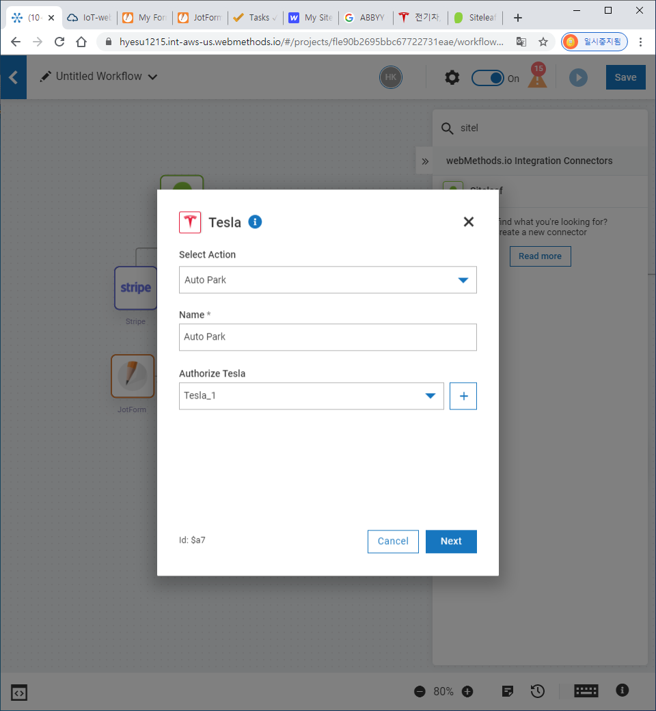

            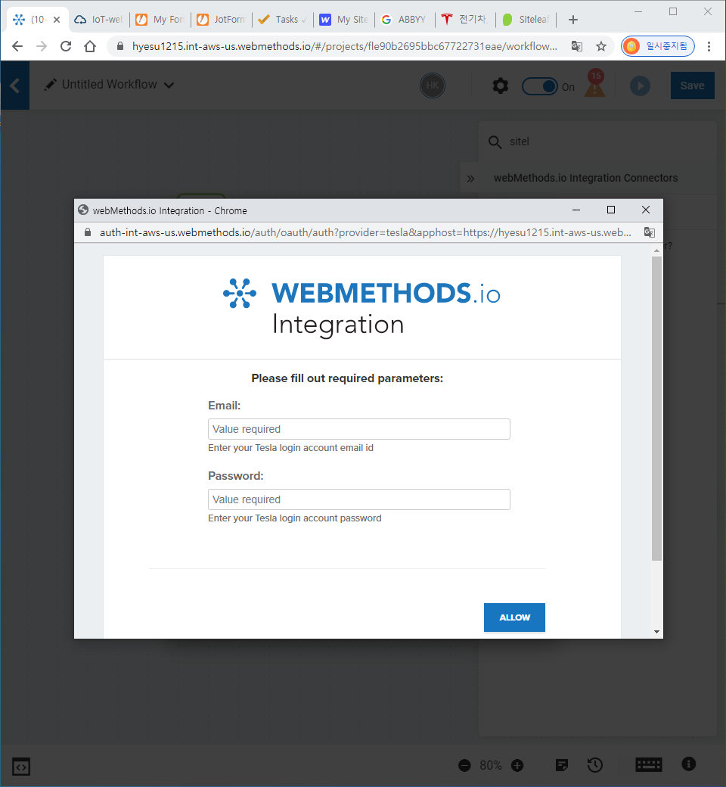
