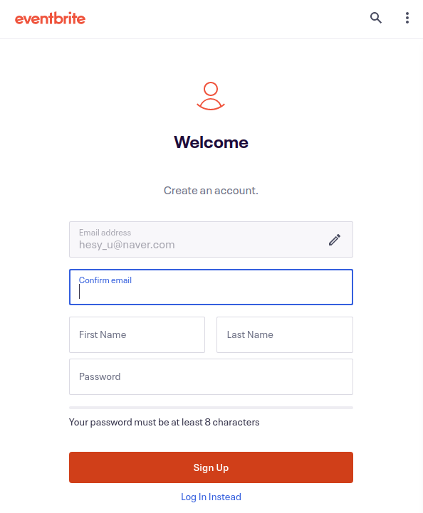

# 0915_Connector_Search_3

- Connectors

    # 1. Bitly

    ---

    ## 1) 서비스 개요

    ---

    

    Bitly는 긴 URL을 단축하고 다른 사용자와 공유 할 수있는 링크 관리 플랫폼입니다. 또한 소셜 미디어 및 마케팅을 위한 기본 제공 분석을 제공합니다.

    ## 2) Authorization

    ---

    [1] 트리거 또는 액션을 구성하기 위해 Bitly 계정을 작성하려고 할 때마다 다음 창이 표시됩니다.

    

    [2] 구글, 페이스북, 트위터, 애플 계정으로 로그인 하거나 Bitly 계정으로 로그인 할 수 있습니다.

    

    

    ## 3) Action

    [1] Create Bitlink : 지정된 긴 URL에 대한 비트 링크 생성

    [2] Get Bitlink Clicks : 지정된 비트 링크에 대한 총 클릭 수를 검색합니다.

    [3] Get Bitlink Info : 지정된 비트 링크의 세부 정보를 검색합니다.

    [4] Get Long URL : 지정된 비트 링크와 연결된 원래의 긴 URL을 검색합니다.

    [5] Get Popular Bitlinks : 대부분의 클릭으로 비트 링크를 검색합니다.

    [6] Get Total Clicks : 계정의 총 클릭 수를 가져옵니다.

    [7] Save as Bitlink : 지정된 긴 URL을 비트 링크로 저장

    [8] Update Bitlink Details : 지정된 비트 링크의 정보를 업데이트합니다.

    # 2. Eventbright

    ---

    ## 1) 서비스 개요

    ---

    

    Eventbrite는 소셜 네트워크와 이메일을 통해 이벤트를 검색, 생성, 계획, 홍보, 판매하고 이벤트를 게시 할 수있는 이벤트 관리 도구입니다. 행사를 주최하는 사람과 참석하는 사람 모두에게 제공합니다.

    ## 2) Authorization

    ---

    [1] 트리거 또는 액션을 구성하기 위해 Eventbright 계정을 작성하려고 할 때마다 다음 창이 표시됩니다.

    

    [2] eventbrite 사이트에서 가입한 계정을 입력하거나 애플 또는 페이스북 계정으로 사용할 수 있습니다.

    

    [3] 사이트에서 회원가입을 합니다.

    

    [4] 생성한 계정 정보로 인증을 받습니다.

    

    ## 3) Trigger

    ---

    [1] Event Published : 이벤트가 게시 될 때 트리거됩니다.

    [2] Order Placed : 이벤트가 게시 취소 될 때 트리거됩니다.

    [3] Event Unpublished : 새 주문이있을 때 트리거됩니다.

    [4] Order Updated : 기존 주문이 업데이트 될 때 트리거됩니다.

    [5] Order Refunded : 주문이 환불 될 때 트리거됩니다.

    ## 4) Action

    ---

    [1] Search Events : 특정 검색 기준을 사용하여 이벤트 검색

    [2] Unpublish Event : 기존 이벤트 게시 취소

    [3] Publish Event : 기존 이벤트를 게시합니다.

    [4] Get Organizers : 하나 이상의 주최자의 세부 정보를 검색합니다.

    [5] Get Event Details : 하나 이상의 이벤트에 대한 세부 정보를 가져옵니다.

    [6] Create Organizer : 새 주최자 만들기

    [7] Create Event : 새 이벤트 생성

    [8] Get Order Details : 특정 주문의 세부 정보를 가져옵니다.

    # 3. FormStack

    ---

    ## 1) 서비스 개요

    ---

    

    Formstack은 설문 조사, 이벤트 등록, 문의 양식 및 주문 양식과 같은 모든 유형의 양식을 만들 수있는 온라인 양식 작성 응용 프로그램입니다.

    ## 2) Authorization

    ---

    [1] 트리거 또는 액션을 구성하기 위해 FormStack 계정을 작성하려고 할 때마다 다음 창이 표시됩니다.

    

    [2] FormStack 홈페이지에서 가입을 해야합니다.

    

    [3] 필요한 정보를 입력해주면 가입이 완료되고 인증이 완료됩니다.

    

    ## 3) Trigger

    ---

    [1] New Submission : 새 제출이 제출 될 때 트리거됩니다.

    ## 4) Action

    ---

    [1] Create Notification : 새 알림 생성

    [2] Delete Submission : 기존 제출물을 삭제합니다.

    [3] Get Notifications : 지정된 양식에 대한 모든 알림을 검색합니다.

    [4] Get Submission Details : 특정 제출에 대한 세부 정보 검색

    [5] Get Submissions : 특정 양식에 대한 모든 제출물을 검색합니다.

    [6] List Forms : 모든 기존 양식 나열

    [7] Submit A Form : 지정된 양식에 대한 새 제출 만들기

    # 4. Wrike

    ---

    ## 1) 서비스 개요

    ---

    

    Wrike는 일반 회사에서 부서간 혹은 프로젝트 별로 서로 업무를 주고받으며 어떤 일을 진행해야 하는지 그리고 앞으로 할 일이 무엇인지 등등 업무 스케쥴을 관리하는 프로그램입니다.

    ## 2) Authorization

    ---

    [1] 트리거 또는 액션을 구성하기 위해 Wrike 계정을 작성하려고 할 때마다 다음 창이 표시됩니다.

    

    [2] 허가를 받습니다.

    

    [3] 구글 계정을 이용하여 가입을 하려고 합니다.

    

    [4] 계정 메일에서 인증을 받습니다.

    

    [5] wrike 홈페이지에서 wrike 계정을 생성해줍니다.

    

    

    

    ## 3) Trigger

    ---

    [1] New Task : 새 작업이 생성 될 때 트리거됩니다.

    [2] Task Updated : 작업이 업데이트 될 때 트리거됩니다.

    [3] New Folder : 새 폴더가 생성 될 때 트리거됩니다.

    [4] Folder Updated : 폴더가 업데이트 될 때 트리거됩니다.

    [5] New Project : 새 프로젝트가 생성 될 때 트리거됩니다.

    [6] Project Updated : 프로젝트가 업데이트 될 때 트리거됩니다.

    ## 4) Action

    ---

    [1] Create Folder or Project : 새 폴더 또는 프로젝트 생성

    [2] Create Task : 특정 폴더에 새 작업을 만듭니다.

    [3] Create Workflow : 특정 계정에서 새 워크 플로 만들기

    [4] Get Workflows : 특정 계정의 모든 워크 플로를 검색합니다.

    [5] Delete Folder : 특정 폴더를 삭제합니다.

    [6] Delete Task : 특정 작업을 삭제합니다.

    [7] Get Accounts : 모든 계정 가져 오기

    [8] Get Contacts : 모든 연락처 가져 오기

    [9] Get Folder : 특정 폴더의 세부 정보를 검색합니다.

    [10] Get Folders : 모든 폴더를 가져옵니다.

    [11] Get Invitations : 특정 계정의 모든 초대를 검색합니다.

    [12] Get Tasks : 일부 또는 모든 작업 검색

    [13] Get Workflows : 일부 또는 모든 워크 플로 검색

    [14] Invite user : 특정 사용자 초대

    [15] Update Contact : 특정 연락처 업데이트

    # 5. Runscope

    ---

    ## 1) 서비스 개요

    ---

    

    Runscope는 사용자가 복잡한 API 문제를 해결하고 항상 최적의 API 성능을 보장하는 데 도움이되는 간단한 API 모니터링 및 테스트 도구입니다.

    ## 2) Authorization

    ---

    [1] 트리거 또는 액션을 구성하기 위해 Runscope 계정을 작성하려고 할 때마다 다음 창이 표시됩니다.

    

    

    ## 3) Action

    ---

    [1] Get Bucket List : 모든 버킷 목록을 검색합니다.

    [2] Get Bucket Details : 특정 버킷의 세부 정보를 검색합니다.

    [3] Delete Bucket : 특정 버킷을 삭제합니다.

    [4] Create Bucket : 특정 팀 아래에 새 버킷을 만듭니다.
