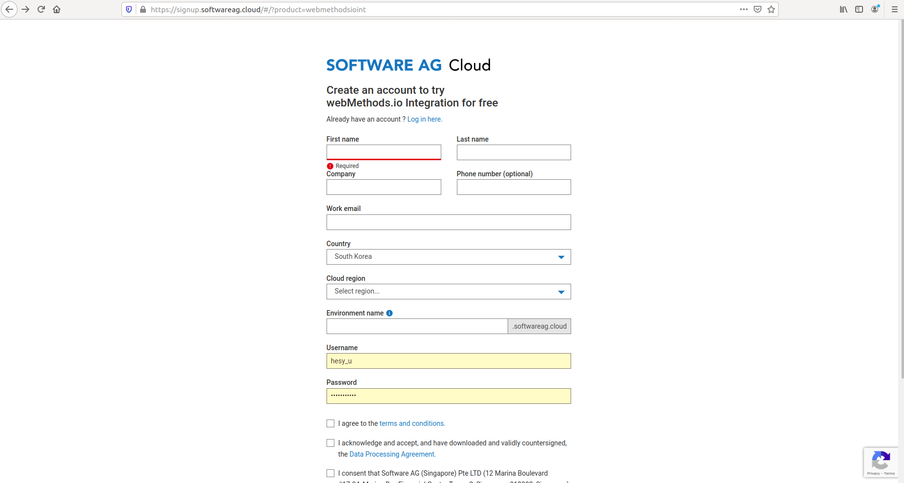
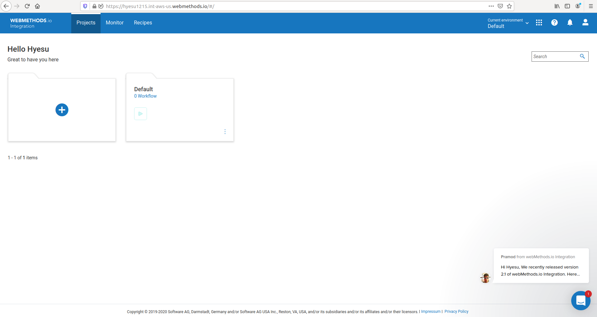

# SOFTWARE AG Youtube Summary

- SOFTWARE AG 유튜브 내용 정리
    - [webMethods.io](http://webmethods.io) Integration Tutorials 2020
        - 1강 - How to register for a free account
            - 실습 정리
                1. 회원가입 화면으로 이동

                    [www.softwareag.cloud](http://www.softwareag.cloud) 접속 - Products - [webMethods.io](http://webmethods.io) Integration - 오른쪽 상단에 Try for free 클릭

                    

                2. 빈칸 다 채워주고 세개 다 체크

                    

                3. 가입할 때 작성했던 Environment name을 입력

                    

                4. 가입할 때 작성했던 Username과 Password 입력

                    

                5. [webMethods.io](http://webmethods.io) Integration 오픈

                    

                6. 대시보드가 나타난다

                    

        - 5강 - Types of Actions
            - TABLE OF CONTENTS
                - What are Actions?
                - Types of Actions in [webMethods.io](http://webmethods.io) Integration
                - How to use Actions in your workflows?
            - Whart are Actions?
                - A workflow is made up of a  trigger and an action.
                - An action specifies the tasks that you want the workflow to perform.
                - Workflow Name: Create a new note on Evernote for new tweets and retweets on Twitter
                - Trigger: Twitter - New Tweet or Retweet Posted By Me
                - Action: Evernote - Create Note
            - Types of Actions
                - Services
                    - 서비스 범주에는 [webMethods.io](http://webmethods.io/) Integration에서 지원하는 모든 외부 웹 서비스(커넥터)가 포함 (IoT 커넥터 제외).
                - Utility
                    - 유틸리티 범주 아래에 나열된 것은 [webMethods.io](http://webmethods.io/) Integratio 팀에서 만든 개발자 친화적인 사용자 지정 응용 프로그램이다. 이러한 애플리케이션 및 관련 작업을 사용하여 HTTP 요청을 보내고 복잡한 파일 작업을 수행하고 데이터를 변환 할 수 있습니다.
                - IoT
                    - IoT 범주에는 [webMethods.io](http://webmethods.io/) Integration에서 지원하는 모든 IoT 기반 애플리케이션이 포함된다. 이러한 애플리케이션을 사용하여 다양한 IoT 장치를 [webMethods.io](http://webmethods.io/) Integration과 쉽게 통합하고 일상적인 활동을 단순화 할 수 있다.
                - Custom
                    - [webMethods.io](http://webmethods.io/) 통합을 사용하면 사용자 지정 코드를 추가하여 자신의 응용 프로그램과 작업을 만들 수 있다. 이러한 작업은 사용자 지정 범주에 나열된다 . Node.js 블록 옆 에있는 + 아이콘 을 클릭하여 새 사용자 지정 작업을 만들 수도 있다 .
        - 9강 - Project Parameters
            - TABLE OF CONTENTS
                - What are Project Parameters?
                - Adding a Parameter
                - Editing a Parameter
                - Deleting a Parameter
                - Using Parameters

            - What are Project Parameters?
                - 프로젝트 매개 변수를 사용하면 프로젝트에 맞춤 키-값 쌍을 추가 할 수 있다.
                - 특정 값을 반복해서 입력 할 필요가 없다.
                - 생성한 매개 변수는 해당 프로젝트의 모든 워크 플로우 내에서 사용할 수 있다.
                - 예를 들어 **이메일** 을 키로 사용하고 **someone@example.com** 을 값으로 사용하여 프로젝트 매개 변수를 정의 하면 워크 플로에서 작업을 구성 할 때 입력 필드에 전체 이메일 ID를 입력 할 필요가 없다. 매개 변수 이름을 클릭하여 프로젝트 매개 변수를 입력으로 간단히 삽입 할 수 있다.

            - Adding a Parameter
                - Project Page

                    Projects > Configurations > Workflow > Parameter

                    

                    - **Name** : 프로젝트 매개 변수에 적합한 이름을 제공.
                    - **Value** : 프로젝트 매개 변수의 값을 제공.
                    - **Mark as Mandatory** : 선택적으로 지정된 매개 변수를 필수로 표시 할 수 있다. 이러한 매개 변수의 경우 webMethods.io Integration은 워크 플로 실행시 매개 변수 값을 사용할 수 있는지 확인한다. 값을 사용할 수 없으면 워크 플로 실행이 성공적으로 완료되지 않는다. 따라서 매개 변수를 필수로 표시하면 값이 있어야한다.
                    - **Set as Password Field** : 선택적으로 지정된 매개변수를 비밀번호 필드로 표시하여 매개 변수 값을 숨길 수 있다.

                    - 두 매개 변수가 동일한 키 이름을 가질 수 없다.
                    - 필수 매개 변수의 경우 매개 변수를 생성하려면 값을 입력해야한다.
                    - 암호 필드로 설정 상자를 선택하여 중요한 정보를 숨긴다.

                - Workflow Page

                    

                    

            - Editing a Parameter

                Projects > Configurations > Workflow > Parameter

                Edit Parameter 버튼 클릭

                

                

            - Deleting a Parameter

                Projects > Configurations > Workflow > Parameter

                Delete 버튼 클릭

                

                

            - Using a Parameter

                

                - 값을 반복적으로 입력하는 대신 기존 매개 변수를 사용하여 시간을 절약한다.
                - 워크 플로우에서 매개 변수를 사용할 때 [webMethods.io](http://webmethods.io/) 통합은 해당 매개 변수의 값을 사용할 수 있는지 확인한다. 값을 사용할 수없는 경우 워크 플로가 실행되지 않는다.

        - 13강 - Filters
            - TABLE OF CONTENTS
                - What are Filters?
                - How to set up and use Filters?
                - Filters vs. Conditions
            - What are Filters?
                - 워크 플로의 트리거에 조건을 추가한다.
                - 워크 플로는 지정된 조건이 충족되는 경우에만 진행된다.
                - 테스트 트리거 창의 출력 화면에서 필터 창에 액세스한다.

                    

            - How to set up and use Filters?
                - Workflow : 제목에 'Support Request'라는 단어가 포함 된 Evernote의 새 노트에 대한 이메일 알림을받습니다.

                    

                    

                    

            - Filters vs. Conditions

                
