# SOFTWARE AG 유튜브 내용 정리

- SOFTWARE AG 유튜브 내용 정리
    - [webMethods.io](http://webmethods.io) Integration Tutorials 2020
        - 1강 - How to register for a free account
            - 실습 정리
                1. 회원가입 화면으로 이동

                    [www.softwareag.cloud](http://www.softwareag.cloud) 접속 - Products - [webMethods.io](http://webmethods.io) Integration - 오른쪽 상단에 Try for free 클릭

                    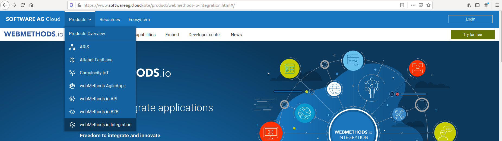

                2. 빈칸 다 채워주고 세개 다 체크

                    

                3. 가입할 때 작성했던 Environment name을 입력

                    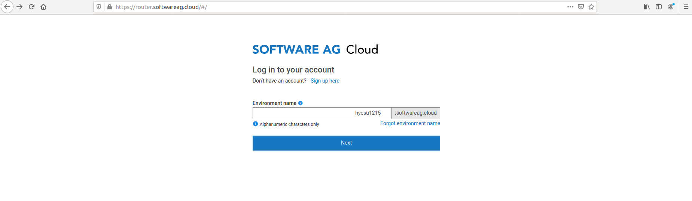

                4. 가입할 때 작성했던 Username과 Password 입력

                    

                5. [webMethods.io](http://webmethods.io) Integration 오픈

                    

                6. 대시보드가 나타난다

                    

        - 2강 - Creating First Workflow
            - TABLE OF CONTENTS
                1. Steps involved in Creating First Workflow
                2. Create a Project
                3. Create a Blank Workflow
                4. Set up Trigger
                5. Set up Action
                6. Complete and Sabe your Workflow
                7. Test your Workflow
            - 실습 정리
                1. 프로젝트를 생성하고 이름을 설정한다.

                    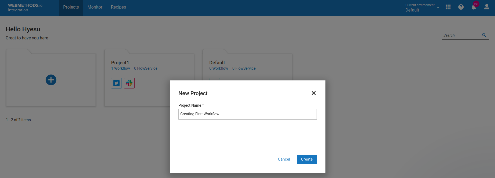

                2. new Workflow 클릭.

                    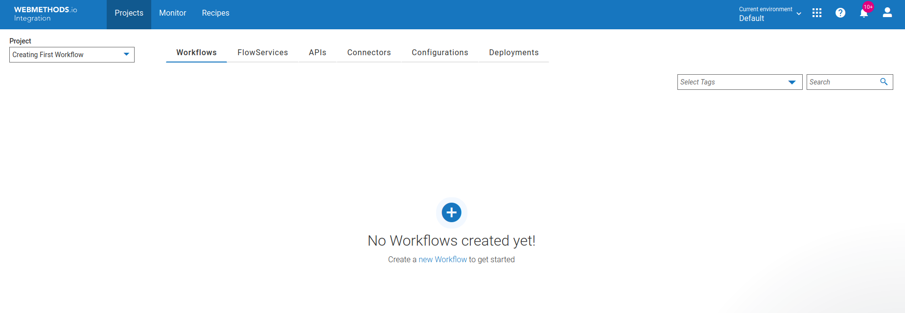

                3. 빈 워크 플로 만들기.
                    - 왼쪽에 Create New Workflow 클릭.

                    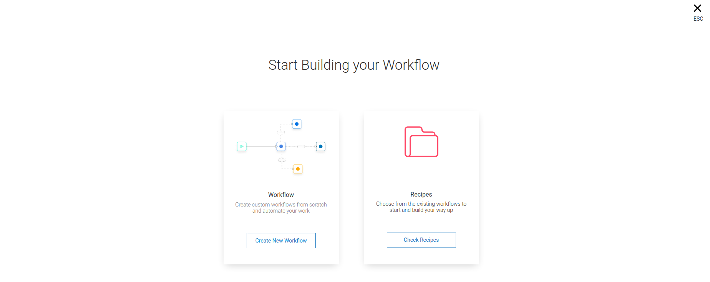

                4. 빈 워크 플로를 볼 수 있는 캔버스로 이동한다.

                    이 곳에서 워크 플로를 만들 수 있다.

                    

                5. 왼쪽 상단에서 Workflow의 이름을 수정할 수 있다.

                    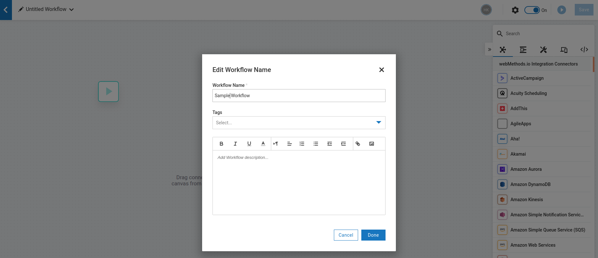

                6. Twitter에 새 트윗을 게시할 때마다 트윗 내용을 Slack 채널로 보내는 워크 플로 만들기.
                    - 워크 플로는 기본적으로 트리거와 하나 이상의 액션으로 이루어진다.
                    - 트리거 → 트위터에 새 트윗을 올릴 때
                    - 액션 → Slack 채널에 게시
                    - 시작 아이콘을 클릭해서 트리거를 설정한다.
                    - Twitter를 찾아 선택한다.

                    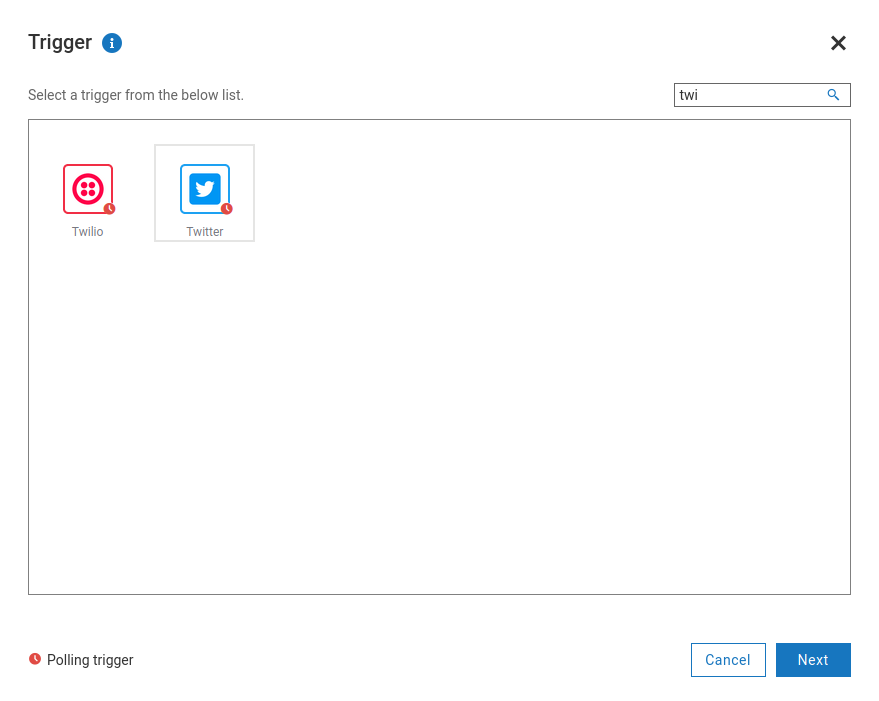

                7. Twitter를 구성한다.
                    - Trigger Label: 적합한 이름을 설정한다.
                    - Select Trigger:  New Tweet or Retweet Posted by Me 트리거를 선택한다.  이 트리거는 Twitter 계정을 통해 트윗을 게시할 때마다 워크 플로 실행을 시작한다.
                    - Authorize Twitter: 작업을 실행하는 데 사용할 계정을 선택한다.

                    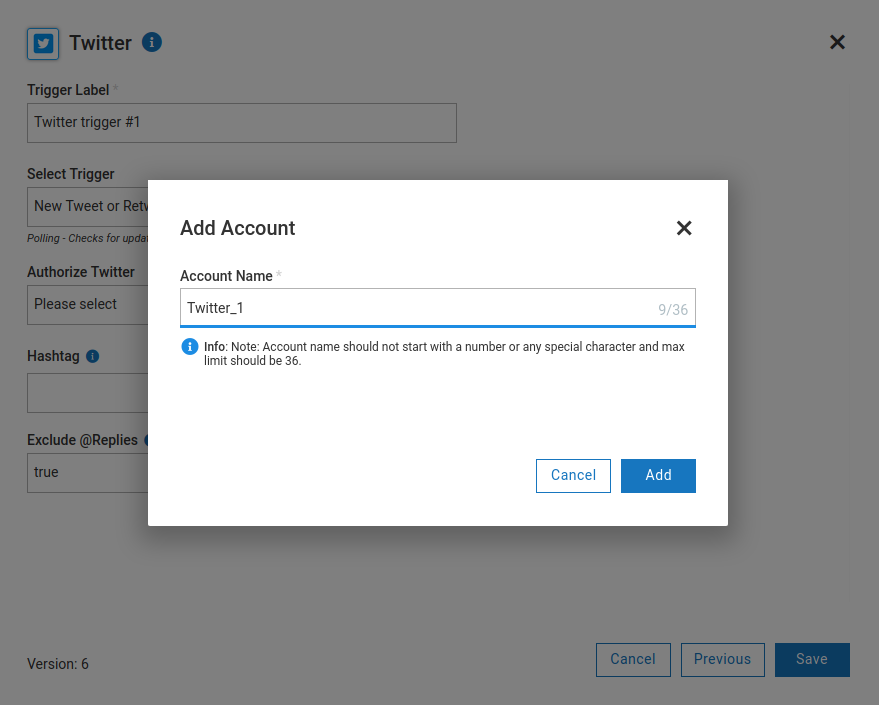

                    - 트위터 계정을 등록해준다.

                    

                    - 계정을 생성하면 다른 모든 Twitter 작업 및 트리거를 실행하는 데 사용할 수 있다.

                    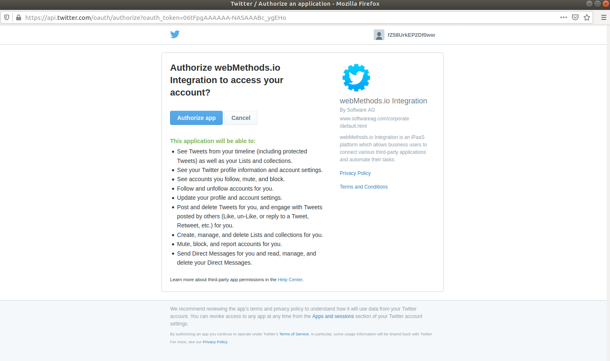

                    - 저장을 클릭하여 트리거를 저장해준다.

                    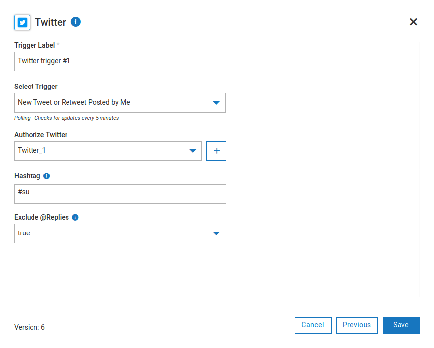

                8. 구성된 트리거 테스트
                    - 트리거에 대한 출력 데이터 표시

                    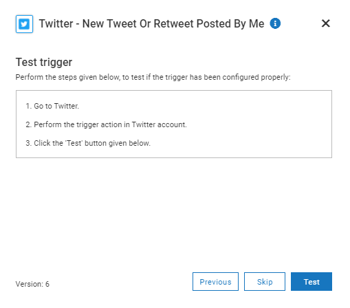

                    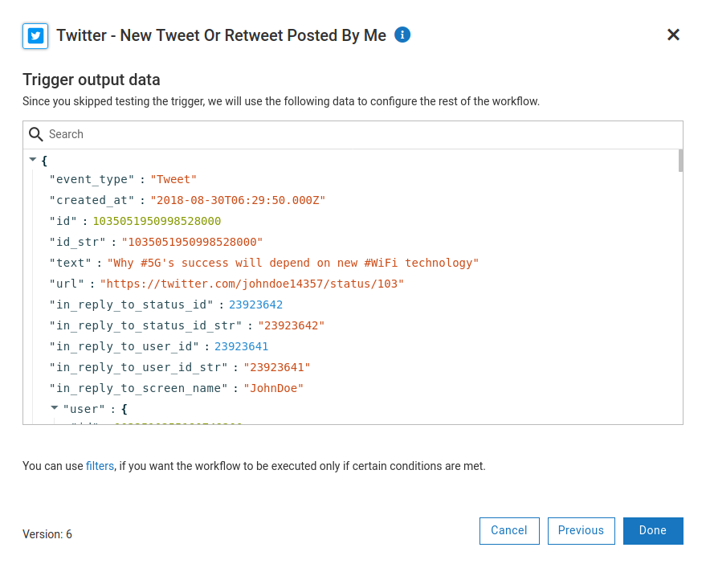

                9. 액션 설정
                    - 오른쪽 커넥터 검색창에 Slack을 찾아 캔버스에 끌어다 놓는다.

                    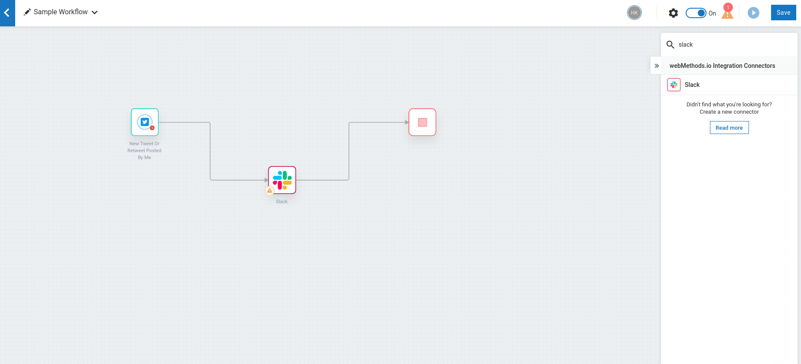

                    - Select Action: Post Message to Channel를 선택
                    - Label: 작업에 적합한 이름을 적는다.

                    

                    - Authorize Slack:  Slack 승인을 추가한다.

                    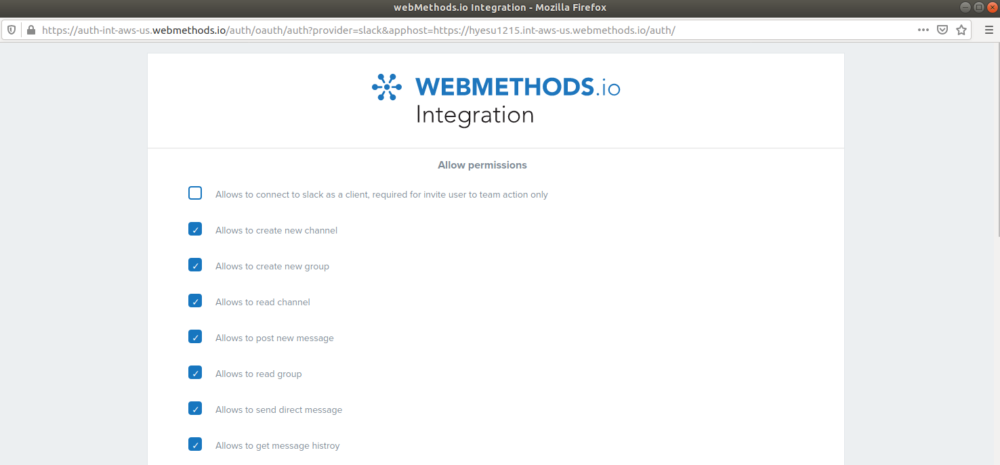

                    

                    - Allow를 클릭하면 Post Message to Channel 구성창이 뜬다.
                    - To: 트윗을 게시 할 채널 유형을 지정한다.
                    - Public Channel ID or Channel Name: 트윗 내용을 게시 할 채널 ID 또는 채널 이름을 선택하거나 지정한다.
                    - Text: 트리거 출력 목록에서 텍스트 필드에 대한 텍스트 매개 변수를 선택한다.

                    

                    10.  워크 플로 완료 및 저장

                    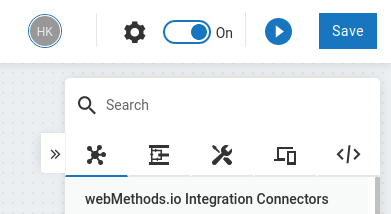

                    

                    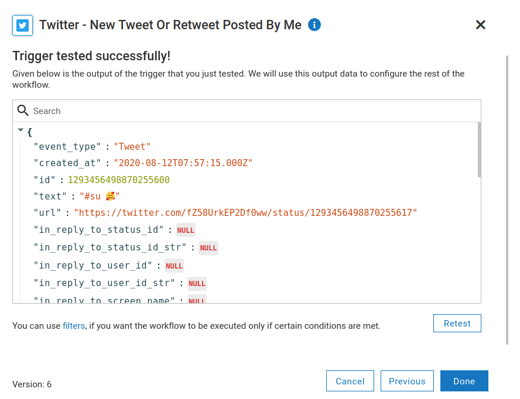

                    11. 실행

                    - 트위터에 글 게시

                    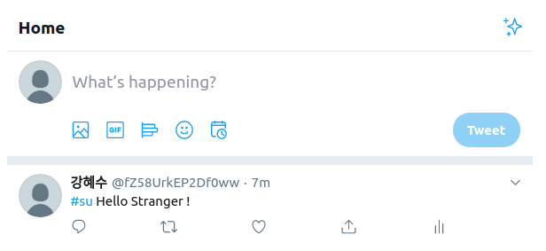

                    - 슬랙에 연결된 트위터 계정의 글이 올라오는 걸 확인할 수 있다.

                    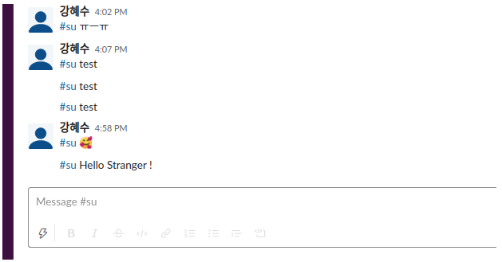

        - 3강 - Projects
            - TABLE OF CONTENTS
                1. Understanding Projects
                2. Project Sections
                3. Working with Projects
            - 실습 정리
                1. 프로젝트 생성 및 편집

                    

                2. 프로젝트 작업 ( 6가지)
                    - Workflows
                        - 프로젝트에는 워크 플로가 포함된다. 새 워크 플로를 만들거나 레시피 에서 워크 플로를 가져올 수 있다 .

                        

                    - FlowServices
                        - FlowServices를 사용하여 단일 서비스 내에서 일련의 서비스를 캡슐화하고 이들 간의 데이터 흐름을 관리하고 여러 애플리케이션 끝점을 포함하는 복잡한 고급 통합 시나리오를 만들 수 있다.

                        

                    - APIs
                        - [webMethods.io](http://webmethods.io/) 통합을 사용하면 통합 로직을 작성하여 다양한 유형의 커넥터를 통합 할 수 있다. 이 로직은 REST API 및 SOAP API를 사용하여 외부 세계에 노출 될 수 있다 .

                        

                    - Connectors
                        - 정의
                            - 커넥터 섹션에는 화면 왼쪽에 4 개의 하위 섹션이 있다. 이러한 하위 섹션, 즉 미리 정의 된 커넥터 , REST 커넥터 , SOAP 커넥터 , 온-프레미스 커넥터 및 플랫 파일 커넥터 를 사용하여 다양한 작업을 수행 할 수 있다.

                                

                        - Predefined Connectors
                            - [webMethods.io](http://webmethods.io/) Integration은 사전 정의되고 구성 가능한 커넥터 세트를 제공하므로 특정 SaaS 공급자에 연결할 수 있다.
                        - REST Connectors
                            - REST 리소스 및 메서드를 정의하고 사용자 지정 REST 커넥터를 만들 수 있다. REST 커넥터를 사용하여 FlowService에서 REST API를 호출 할 수  있다.
                        - SOAP Connectors
                            - 사용자 지정 SOAP 커넥터를 사용하면 클라우드 또는 온 프레미스 환경에서 호스팅되는 타사 웹 서비스에 액세스 할 수 있다. SOAP 커넥터를 사용하여 FlowService에서 SOAP API를 호출 할 수도 있다.
                        - On-Premises Connectors
                            - 온 프레미스 시스템에서 업로드 된 온 프레미스 애플리케이션이 온 프레미스 커넥터 페이지에 나열된다.
                        - Flat File Connectors
                            - [webMethods.io](http://webmethods.io/) 통합에서 생성 된 플랫 파일 커넥터.
                    - Configurations
                        - 구성 섹션을 통해 워크 플로 및 FlowService 구성을 관리할 수 있다. 이 섹션에는 화면 왼쪽에 세 개의 하위 섹션이 있다.

                        

                    - Deployments
                        - 이 섹션에는 새 키 저장소 및 신뢰 저장소를 추가하기위한 인증서 페이지가 있다.

                        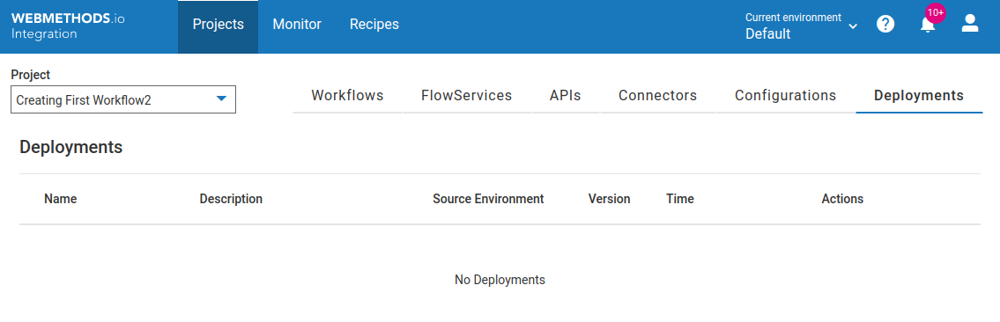

        - 4강 - Triggers
            - TABLE OF CONTENTS
                1. What are Triggers?
                2. Types of Triggers
                3. How to configure and test Triggers
            - WHAT ARE TRIGGERS?
                - 정의된 이벤트가 발생하면 자동으로 워크 플로를 시작한다. 이를 통해 매번 워크 플로를 수동으로 실행하지 않고도 복잡한 비즈니스 프로세스를 자동화 할 수 있다.
            - WHAT ARE POLLING TRIGGERS?
                - 정기적으로 (예 : 5 분마다) 변경 사항을 확인하는 트리거.  실시간으로 [webMethods.io](http://webmethods.io/) Integration에 데이터를 보내지 않을 수 있다. 모든 폴링 트리거는 트리거 목록에서 시계 기호로 표시된다.

                    

            - WHAT ARE WEBHOOK TRIGGERS?
                - 웹훅트리거는 업데이트를 지속적으로 확인한다.
                - 실시간으로 [webMethods.io](http://webmethods.io/) Integration에 데이터를 전송하여 외부 앱 또는 서비스에서 지정된 이벤트가 발생하는 즉시 워크 플로를 실행할 수 있다.
        - 5강 - Types of Actions
            - TABLE OF CONTENTS
                - What are Actions?
                - Types of Actions in [webMethods.io](http://webmethods.io) Integration
                - How to use Actions in your workflows?
            - Whart are Actions?
                - A workflow is made up of a  trigger and an action.
                - An action specifies the tasks that you want the workflow to perform.
                - Workflow Name: Create a new note on Evernote for new tweets and retweets on Twitter
                - Trigger: Twitter - New Tweet or Retweet Posted By Me
                - Action: Evernote - Create Note
            - Types of Actions
                - Services
                    - 서비스 범주에는 [webMethods.io](http://webmethods.io/) Integration에서 지원하는 모든 외부 웹 서비스(커넥터)가 포함 (IoT 커넥터 제외).
                - Utility
                    - 유틸리티 범주 아래에 나열된 것은 [webMethods.io](http://webmethods.io/) Integratio 팀에서 만든 개발자 친화적인 사용자 지정 응용 프로그램이다. 이러한 애플리케이션 및 관련 작업을 사용하여 HTTP 요청을 보내고 복잡한 파일 작업을 수행하고 데이터를 변환 할 수 있습니다.
                - IoT
                    - IoT 범주에는 [webMethods.io](http://webmethods.io/) Integration에서 지원하는 모든 IoT 기반 애플리케이션이 포함된다. 이러한 애플리케이션을 사용하여 다양한 IoT 장치를 [webMethods.io](http://webmethods.io/) Integration과 쉽게 통합하고 일상적인 활동을 단순화 할 수 있다.
                - Custom
                    - [webMethods.io](http://webmethods.io/) 통합을 사용하면 사용자 지정 코드를 추가하여 자신의 응용 프로그램과 작업을 만들 수 있다. 이러한 작업은 사용자 지정 범주에 나열된다 . Node.js 블록 옆 에있는 + 아이콘 을 클릭하여 새 사용자 지정 작업을 만들 수도 있다 .
        - 6강 - Connectors
            - TABLE OF CONTENTS
                - What are Connectors?
                - List of Connectors available in [webMethods.io](http://webmethods.io) Integration
                - Types of Connectors
                - Connector Builder
            - Categories
                - Predefined Connectors
                    - 미리 정의되고 구성 가능한 커넥터.  Predefined Connectors를 사용하면 SaaS 공급자에 연결할 수 있다.
                - REST Connectors
                    - REST 리소스 및 메서드를 정의하고 사용자 지정 REST 커넥터를 만들 수 있다. REST 커넥터를 사용하여 FlowService에서 REST API를 호출 할 수 있다.
                - SOAP Connectors
                    - 사용자 지정 SOAP 커넥터를 사용하면 클라우드 또는 온 프레미스 환경에서 호스팅되는 타사 웹 서비스에 액세스 할 수 있다. SOAP 커넥터를 사용하여 FlowService에서 SOAP API를 호출 할 수도 있다.
                - On-Premises Connectors
                    - 온 프레미스 시스템에서 업로드 된 온 프레미스 애플리케이션이 온 프레미스 커넥터 페이지에 나열된다.
                - Flat File Connectors
                    - [webMethods.io](http://webmethods.io/) Integration에서 생성 된 플랫 파일 커넥터.
            - 정리

                모든 커넥터에는 connection (Account(계정))과 operation (Action)이 있다. 사전 정의 된 커넥터는 계정을 사용하여 공급자의 백엔드에 연결하고 작업을 수행하며 사전 정의 된 작업 집합과 함께 제공된다. 각 커넥터에는 지원되는 작업 집합이 다르다. 고유한 사용자 지정 작업을 만들 수도 있다.

        - 7강 - Accounts
            - TABLE OF CONTENTS
                - What are Accounts?
                - How to create an Account?
                - Managing your Accounts
                - Useful Links
            - What are Accounts?
                - Account(계정)를 사용하면 [webMethods.io](http://webmethods.io/) Integration에 필요한 권한 또는 기본 계정 세부 정보를 부여하여 사용자를 대신하여 외부 웹 서비스에서 작업을 수행 할 수 있다.
                - 계정은 프로젝트 수준에서 생성되고 사용된다. 즉, 특정 프로젝트에 대한 계정을 생성하면 해당 프로젝트에서 생성된 모든 워크플로에서 사용할 수 있다.
                - 서비스에 대해 생성할 수 있는 계정 수에는 제한이 없다.
        - 8강 - Recipes
            - TABLE OF CONTENTS
                - What is Recipes?
                - Where to find the Recipes section
                - Types of Recipes
                - Useful Links
            - WHAT IS RECIPES?
                - 레시피 섹션에는 쉽게 사용할 수있는 사전 구성된 여러 워크 플로가 포함되어 있다. 레시피에서 워크플로를 가져오거나 내보낸다.
                - Import and use
            - MY RECIPES
                - 내 레시피 섹션을 사용하면 레시피 섹션에 워크 플로 별 스키마를 업로드 할 수 있다.
                - 업로드되면 이러한 스키마는 프로젝트로 가져올 수있는 워크 플로로 자동 변환된다.
            - ALL RECIPES
                - 모든 레시피 섹션에서는 사전 구성된 워크 플로를 원하는 프로젝트로 가져올 수 있다.
                - 이러한 워크 플로는 나중에 요구 사항에 따라 사용자 지정할 수 있다.
